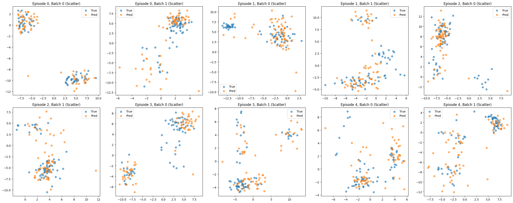
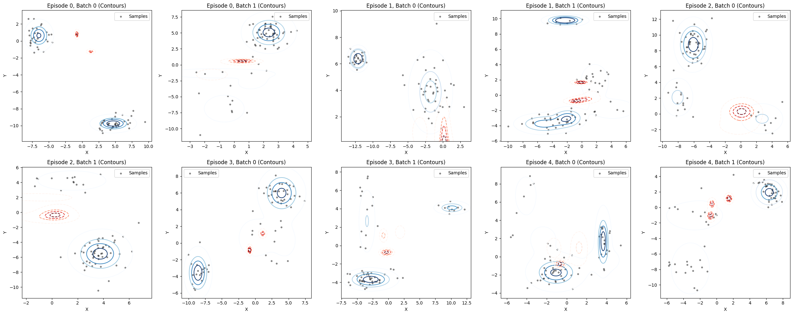

# In-Context Density Estimation (ICDE)
### Transformer + Mixture Density Networks for Amortised Density Modelling


---

## 📌 Overview

This repository contains a clean, modular PyTorch implementation of  
**In-Context Density Estimation (ICDE)** using:

- **Transformer encoder** for context/query embeddings  
- **Mixture Density Networks (MDN)** for conditional density output  
- **Synthetic 2D Gaussian mixture episodes**  
- **Amortised evaluation on unseen mixtures**

This project was originally developed as part of my **MSc dissertation** in probabilistic machine learning. Please read the Report.pdf for detailed report about the working, methodology and achievements.

---

## 🗂️ Repository Structure

```
src/
  datasets.py       # Episodic GMM generator
  model.py          # Transformer + MDN
  losses.py         # MDN NLL
  utils.py          # Sampling & metrics
  train.py          # Training loop
  eval.py           # Evaluation script

requirements.txt
README.md
LICENSE
```

---

## 🚀 Quickstart

### 1. Install dependencies
```
pip install -r requirements.txt
```

### 2. Train a model
```
python -m src.train --n-episodes 2000 --epochs 30
```

### 3. Evaluate on new episodes
```
python -m src.eval --checkpoint ckpt_best.pt
```

---

## 📊 Example Output (Mixture Predictions)

### Episode-level Density Prediction
Below is an example of context points (blue) and predicted samples (orange):





---

## 🧠 Method Summary

The ICDE model observes a small set of **context points** from a target density,  
then predicts the full density using a **Transformer + MDN head**, enabling:

- amortised inference  
- meta-learning behaviour  
- generalisation to new unseen mixtures

---

## 📝 Citation

If you use this code, please cite:

```
@misc{icde2025mal,
  author = {Manan Mal},
  title = {In-Context Density Estimation with Transformers and Mixture Density Networks},
  year = {2025},
  note = {MSc Research Project},
}
```

---

## 📄 License

MIT License © 2025 Manan Mal
